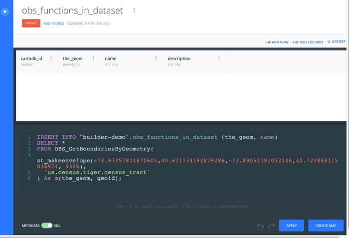
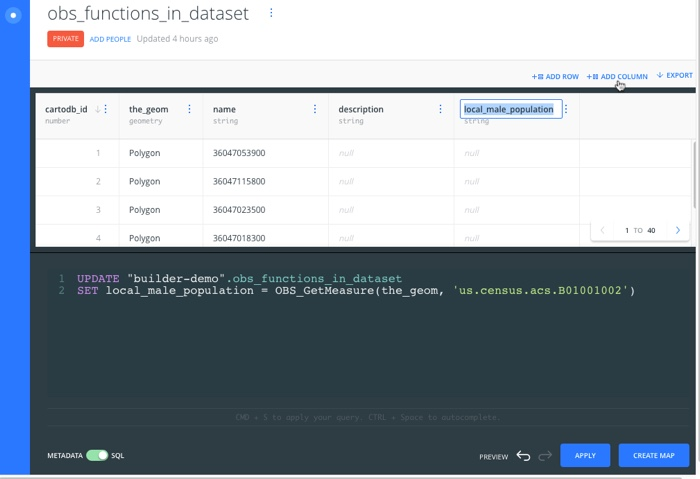
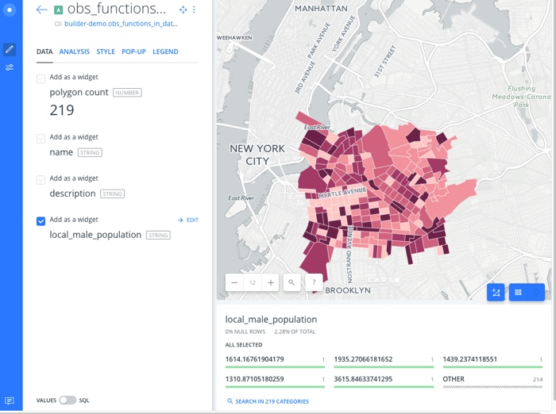

## Accessing the Data Observatory

The workflow for accessing the Data Observatory includes using a SQL query to apply a specific method of data enrichment or analysis to your data. You can access the Data Observatory by applying a custom query in CARTO Builder, or directly through the SQL API.

#### Prerequisites

You must have an Enterprise account and be familiar with using SQL requests.

- The Data Observatory catalog includes data that is managed by CARTO, on a SaaS cloud platform. For Enterprise users, the Data Observatory can be enabled by contacting CARTO.

- A set of Data Observatory functions (prefaced with "OBS" for Observatory), allow you to retrieve boundaries and measures data through a SQL request. These functions should be used with UPDATE and INSERT statements, not SELECT statements, as we are currently not supporting dynamic use of the Data Observatory 

**Tip:** See the recommended [Best Practices](#best-practices) for using the Data Observatory.

### Enrich from Data Observatory

As an alternative to using SQL queries, you can apply the _Enrich from Data Observatory_ ANALYSIS to a selected map layer in CARTO Builder. This enables you add a new column with contextual demographic and economic measures, without having to apply the code yourself. For details, see the [Enrich from Data Observatory Guide](https://carto.com/learn/guides/analysis/enrich-from-data-observatory) in our Learn hub.

### Apply OBS Functions to a Dataset

This procedure describes how to access the Data Observatory functions by applying SQL queries in a selected dataset.

1) Review the [prerequisites](#prerequisites) section before attempting to access any of the Data Observatory functions

2) [View the Data Observatory Catalog](https://cartodb.github.io/bigmetadata/index.html)

An overview for each of the analyzed functions of data appears, and indicates the unique function signature needed to access the catalog item. You can copy the OBS function from the Data Observatory catalog and modify the placeholder parameters shown in curly brackets (e.g. "{table_name}").

3) From _Your datasets_ dashboard in CARTO, click _NEW DATASET_ and _CREATE EMPTY DATASET_. 

This creates an untitled table. You can get population measurements from the Data Observatory to build your dataset and create a map.

4) 	The SQL view is available when you are viewing your dataset in table view (Data View). Click the slider to switch between viewing your data by METADATA (table) to _SQL_ (opens the SQL view). 

5) Apply the OBS function to modify your table. 

For example, the following image displays a SQL query using the Boundary function, [`OBS_GetBoundariesByGeometry(geom geometry, geometry_id text)`](https://carto.com/docs/carto-engine/data/boundary-functions/#obsgetboundariesbygeometrygeom-geometry-geometryid-text) function. The SQL query inserts the boundary data as a single polygon geometry for each row of data. 




**Tip:** Want to insert population data to create a dataset? Replace `{my table name}` with your dataset name, and apply the SQL query:

```sql
INSERT INTO {my table name} (the_geom, name)
SELECT * 
FROM OBS_GetBoundariesByGeometry(
  st_makeenvelope(-73.97257804870605,40.671134192879286,-73.89052391052246,40.722868115036974, 4326),
  'us.census.tiger.census_tract'
) As m(the_geom, geoid);
```

Another example shows how to get the local male population into your dataset. Before applying the SQL query, click _ADD COLUMN_ to create and name a column to store the [`OBS_GetMeasure`]({{ site.dataobservatory_docs}}/reference/#obsgetmeasurepolygon-geometry-measureid-text) data.



**Tip:** Want to update your dataset to include the local male population from the Data Observatory? Replace `{my table name}` with your dataset name, and apply the SQL query:

```sql
UPDATE {my table name}
SET local_male_population = OBS_GetMeasure(the_geom, 'us.census.acs.B01001002')
```
6) Click _CREATE MAP_ from your dataset, to visualize the Data Observatory results. You can add custom styling, and add widgets to better visualize your data




### SQL API and OBS Functions

This procedure describes how to access the Data Observatory functions directly through the SQL API.

1. In order to use the SQL API, you must be [authenticated]({{ site.bdataobservatory_docs }}/guides/authentication/#authentication) using API keys

	**Note:** Review the [prerequisites](#prerequisites) section before attempting to access any of the Data Observatory functions and [view the Data Observatory Catalog](https://cartodb.github.io/bigmetadata/index.html) to identify the OBS function you are looking for.

2. Query the Data Observatory directly with a specified `OBS` function to apply the results (Measures/Boundaries data) to your table, with the INSERT or UPDATE function

```sql
https://{username}.carto.com/api/v2/sql?q=UPDATE {tablename}
SET local_male_population = OBS_GetMeasure(the_geom, 'us.census.acs.B01001002')&api_key={api_key}
```
### Tips

Other useful tips about OBS functions:

- Some Data Observatory functions return geometries, enabling you to apply an UPDATE statement with an OBS function, to update `the_geom` column
- To include [water clipping levels]({{ site.dataobservatory_docs }}/guides/overview/#water-clipping-levels) as part of your results, append `_clipped` as part of the OBS function. For example: 

```sql
UPDATE {tablename}
SET local_male_population = OBS_GetMeasure(the_geom, 'us.census.acs.B01001002','area','us.census.tiger.census_tract_clipped')
```

### Best Practices

The following usage notes are recommended when using the Data Observatory functions in SQL queries:

- It is discouraged to use the SELECT operation with the Data Observatory functions in your map layers. The results may be visible, but CARTO may not support dynamic rendering of the Data Observatory in the future, so your visualizations may break

	The Data Observatory is **recommended** to be used with INSERT or UPDATE operations, for applying analyzed measures and boundaries data to your tables. While SELECT (retrieve) is standard for SQL API requests, be mindful of quota consumption and use INSERT (to insert a new record) or UPDATE (to update an existing record), for best practices. 

	**Exception:** [Discovery Functions]({{ site.dataobservatory_docs }}/guides/overview/#discovery-functions) are the exception. You can use SELECT as these functions are not actually retrieving data, they are retrieving ids that you can use for other functions.

- You can reduce storage space for unneeded geometries and optimize query optimizations by applying the PostGIS [`ST_Simplify`](http://www.postgis.org/docs/ST_Simplify.html) function. For example, you can simplify the `the_geom` for a large table of polygons and reduce the size of them for quicker rendering. For other tips, see the [most commonly used PostGIS functions](https://carto.com/docs/faqs/postgresql-and-postgis/#what-are-the-most-common-postgis-functions) that you can apply with CARTO

- Only point or polygon geometries are supported for OBS functions. If you attempt to apply Measures or Boundary results to line geometries, an error appears

- The Data Observatory is optimal for modifying existing tables with analytical results, not for building new tables of data

	**Exception:** Exceptions apply for the following boundary functions, since they were designed to return multiple responses of geographical identifiers, as opposed to a single geometry. Create an empty dataset and build a new dataset from a SQL query, using any one of these boundary functions.

	- [`OBS_GetBoundariesByGeometry(geom geometry, geometry_id text)`]({{ site.dataobservatory_docs }}/reference/#boundary-functions#obsgetboundariesbygeometrygeom-geometry-geometryid-text)
	- [`OBS_GetPointsByGeometry(polygon geometry, geometry_id text)`]({{ site.dataobservatory_docs }}/reference/#boundary-functions#obsgetpointsbygeometrypolygon-geometry-geometryid-text)
	- [`OBS_GetBoundariesByPointAndRadius(point geometry, radius numeric, boundary_id text`]({{ site.dataobservatory_docs }}/reference/#boundary-functions#obsgetboundariesbypointandradiuspoint-geometry-radius-numeric-boundaryid-text)
	- [`OBS_GetPointsByPointAndRadius(point geometry, radius numeric, boundary_id text`]({{ site.dataobservatory_docs }}/reference/#boundary-functions#obsgetpointsbypointandradiuspoint-geometry-radius-numeric-boundaryid-text)

- For optimal performance, each SQL request should not exceed 100 rows. As an alternative, you can use a [SQL Batch Query](/docs/carto-engine/sql-api/batch-queries) for queries with long-running CPU processing times

### Examples

View our [CARTO Blogs](https://carto.com/blog/categories/product/) for examples that highlight the benefits of using the Data Observatory.
